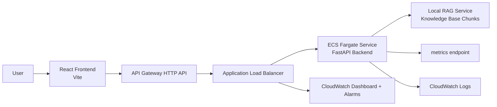
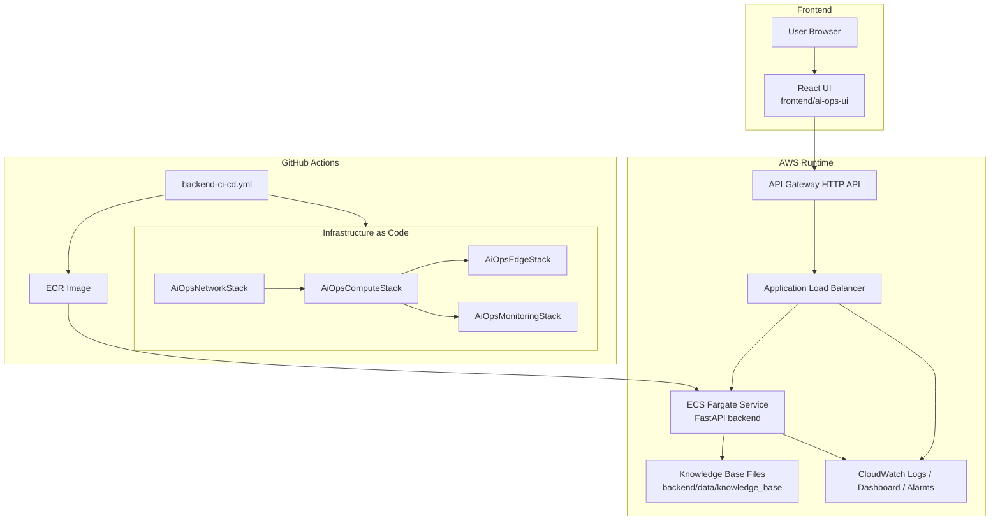

# AI Ops Incident Copilot (Week 4 Ready)

AI Ops Incident Copilot is a portfolio-focused RAG system with a FastAPI backend and React frontend. It supports grounded incident Q&A, incident summarization, and remediation recommendations with production-style hardening and AWS deployment scaffolding.

## What Is Implemented

- Week 1: Layered FastAPI API foundation + logging/config/tests
- Week 2: Local RAG + domain incident endpoints + citations/confidence
- Week 3: Auth/rate-limit/guardrails/metrics/tracing headers/cache/integration tests
- Week 4: Docker packaging + AWS CDK IaC (TypeScript) + CI/CD workflow + demo packaging

## Architecture



## End-to-End Wiring



## Request and RAG Flows

- Request flow: Frontend -> API Gateway -> ALB -> ECS/FastAPI
- RAG flow: `/ask`/incident endpoints -> retrieval over `backend/data/knowledge_base` -> grounded answer with citations/confidence
- Ops flow: FastAPI structured logs + `/metrics` + ALB/ECS metrics -> CloudWatch dashboard/alarms

## Service Level Objectives (Initial)

- Availability: 99.5% monthly for public API endpoints
- Latency: p95 under 1.5s for cached or short grounded responses
- Error budget policy: alert when ALB 5xx exceeds 5/minute

## Tradeoffs and Design Choices

- Local retrieval is deterministic and low-friction for demos; AWS vector store can replace it later.
- API Gateway + ALB is used to show API lifecycle controls while retaining ECS ingress simplicity.
- In-memory cache/rate limiter are fast and simple; Redis/distributed rate limiting is the production upgrade path.

## Local Run

### Backend

```bash
PYTHONPATH=backend backend/venv/bin/python -m uvicorn app.main:app --host 127.0.0.1 --port 8000
```

### Frontend

```bash
cp frontend/ai-ops-ui/.env.example frontend/ai-ops-ui/.env
./frontend/ai-ops-ui/start-dev.sh
```

## Docker

Build backend image:

```bash
docker build -t ai-ops-backend:local backend
```

Run backend container:

```bash
docker run --rm -p 8000:8000 ai-ops-backend:local
```

## IaC (AWS CDK, TypeScript)

See `infra/cdk/README.md`.

Quick start:

```bash
cd infra/cdk
npm install
npx cdk bootstrap
npx cdk deploy --all \
  --require-approval never \
  -c vpcId=<vpc-id> \
  -c publicSubnetIds=<subnet-a>,<subnet-b> \
  -c privateSubnetIds=<subnet-c>,<subnet-d> \
  -c ecrRepositoryName=<ecr-repo-name>
```

## CI/CD

Workflow: `.github/workflows/backend-ci-cd.yml`

Pipeline stages:
- Test backend on PR/push
- Build and push backend image to ECR on `main`
- Trigger ECS rolling deployment on `main`

Required GitHub secrets:
- `AWS_ACCESS_KEY_ID`
- `AWS_SECRET_ACCESS_KEY`
- `AWS_REGION`
- `ECR_REPOSITORY`
- `VPC_ID`
- `PUBLIC_SUBNET_IDS`
- `PRIVATE_SUBNET_IDS`
- `ALARM_EMAIL` (optional)

## Demo Script

See `ai-steering/demo_script_week4.md` for a 3-5 minute interview/demo flow.
